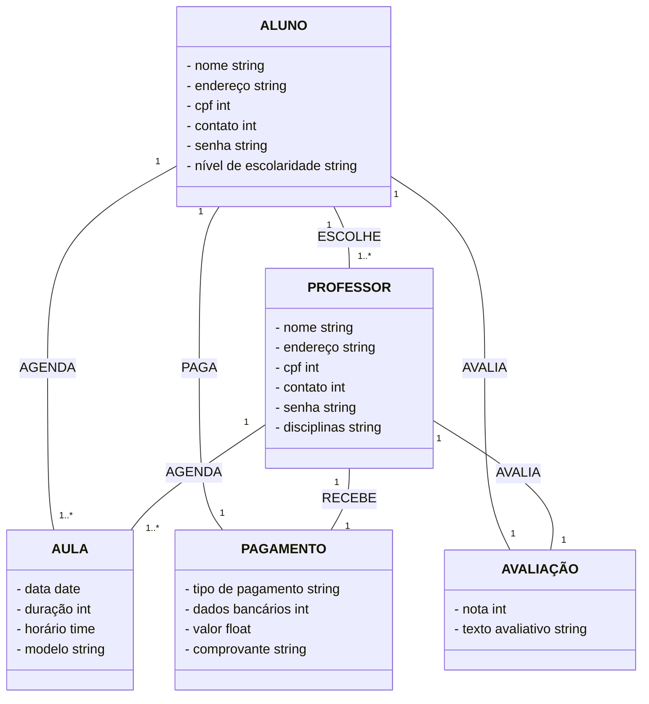

# Conect Educa

> Status do projeto: Em andamento

> Esse projeto nos foi proposto no 5ºSemestre na disciplina de Engenharia de Software

> Escrevemos esse projeto juntos durante as aulas 

> Área de Domínio: Educação

> Projeto: Aplicativo de freelancer para professores particulares

### Tópicos
#### Modelo de Négocio
🔹[Informações](#page_facing_up-informações)

🔹[Processos de Négocios](#pencil-processos-de-négocios)

🔹[Modelagem de Processos](#mag_right-modelagem-de-processos)

🔹[Detalhe as tarefas dos processos de negócio - Em Formato De Texto](#pencil2-detalhe-as-tarefas-dos-processos-de-negócio---em-formato-de-texto)

🔹[Detalhe as tarefas dos processos de negócio - Em Formato De Tabela](#bookmark_tabs-detalhe-as-tarefas-dos-processos-de-negócio---em-formato-de-tabela)

#### Requisitos de Software
🔹[Modelo de Software Escolhido](#chart_with_upwards_trend-modelo-de-software-escolhido)

🔹[Quem São Os Stakeholders?](#bust_in_silhouette-quem-são-os-stakeholders?)

🔹[Requisitos Funcionais E Não Funcionais](#pushpin-requisitos-funcionais-e-não-funcionais)

🔹[Regras De Negócio](#exclamation-regras-de-negócio)

🔹[Protótipos De Telas](#iphone-protótipos-de-telas)

#### Modelagem de Software

#### Projeto de Arquitetura

#### Desenvolvedores 
🔹[Desenvolvedores](#busts_in_silhouette-desenvolvedores)

## Modelo de Négocio
### :page_facing_up: Informações
#### Público Alvo
  Nesse aplicativo buscamos como público alvo todos os estudantes que querem aprender algo novo ou estejam com dificuldade em alguma matéria interagir com professores que buscam ter uma renda extra.
  
#### Propósito
  Facilitar o contato entre professores que queiram dar aulas particulares com alunos que necessitam dessas aulas.
  
#### Lucro
  Pensamos em uma taxa de intermediação da aula. Onde, o négocio recebe uma pequena porcentagem dependendo do valor da aula. Incialmente, pensamos nesssa forma de gerar recursos, futuramente pretendemos adicionar outras formas de receita atráves do aplicativo.

### :pencil: Processos de Négocios
1. Processo de cadastro/login de alunos e professores
2. Processo de busca de professores por alunos 
3. Processo de comunicação entre alunos e professores
4. Processo de monitoramento de aula 
5. Processo de pagamento de serviço
6. Processo de avaliação

### :mag_right: Modelagem de Processos

Para melhor definição acesse o link: https://drive.google.com/file/d/1-HmNsTpe2Uj7nPGJ2esX0hL_f1fhycfJ/view?usp=sharing

### :pencil2: Detalhe as tarefas dos processos de negócio - Em Formato De Texto

#### Processo de Cadastro/Login de Alunos e Professores:
•	Os indivíduos se cadastram na plataforma como alunos ou professores.

•	A plataforma valida os dados fornecidos e, em seguida, envia uma ativação de login para os usuários.

•	Com a ativação concluída, os indivíduos obtêm permissão para acessar a plataforma utilizando suas credenciais.

#### Processo de Busca de Professores pelos Alunos:
•	Professores cadastrados ativam suas contas, tornando-se visíveis na lista de professores disponíveis.

•	A plataforma exibe para os alunos uma lista atualizada de professores ativos.

•	Utilizando um sistema de filtragem, os alunos podem buscar o professor ideal com base em critérios como matéria, disponibilidade de horários, tipo de aula, entre outros.

#### Processo de Comunicação entre Alunos e Professores:
•	Após a seleção de um professor, a plataforma disponibiliza um sistema de comunicação entre ambos para o planejamento das aulas.

•	Com o planejamento concluído, a plataforma agenda a aula.

#### Processo de Monitoramento de Aula:
•	A plataforma oferece um sistema de acompanhamento que monitora o andamento das aulas, seja presencial ou online.

•	O professor ministra a aula no horário combinado com o aluno.

•	Ao término da aula, tanto o aluno quanto o professor confirmam a conclusão da mesma. No caso de aulas online, o encerramento pode ser registrado automaticamente.

#### Processo de Pagamento pelo Serviço:
•	Após a conclusão da aula, a plataforma fornece um sistema para gerenciamento e realização do pagamento.

•	O aluno escolhe o método de pagamento preferido e, uma vez confirmado, a plataforma registra a transação. Caso o pagamento seja feito em espécie, tanto o aluno quanto o professor devem confirmar o recebimento na plataforma.

#### Processo de Avaliação:
•	Ao final de todo o processo, a plataforma libera um sistema de avaliação para que alunos e professores possam avaliar mutuamente a experiência.

### :bookmark_tabs: Detalhe as tarefas dos processos de negócio - Em Formato De Tabela

#### Tarefas realizadas pelo Aluno 

| Nome da tarefa:         | Cadastro de Aluno                                                             |
| :-----------------------| :-----------------------------------------------------------------------------|
| Dados de entrada:       | Dados do aluno                                                                |
| Detalhamento da tarefa: | - O aluno cadastra-se na plataforma - Espera a plataforma validar os dados |
| **Dados de saída:**     | **Mensagem de espera**                                                        |

| Nome da tarefa:         | Login de Aluno                                                                                |
| :-----------------------| :---------------------------------------------------------------------------------------------|
| Dados de entrada:       | Dados do aluno                                                                                |
| Detalhamento da tarefa: | - O aluno espera a liberação do login pela plataforma - O aluno faz o login na plataforma  |
| **Dados de saída:**     | **Acesso a plataforma**                                                                       |

| Nome da tarefa:         | Procura de Professor                                                                                  |
| :-----------------------| :-----------------------------------------------------------------------------------------------------|
| Dados de entrada:       | Palavras-chaves de procura                                                                            |
| Detalhamento da tarefa: | - O aluno digita palavras-chaves para encontrar um professor ideal através dos serviços da plataforma |
| **Dados de saída:**     | **Professor para a aula**                                                                             |

| Nome da tarefa:         | Professor Escolhido                                              |
| :-----------------------| :----------------------------------------------------------------|
| Dados de entrada:       | Mensagens pela plataforma                                        |
| Detalhamento da tarefa: | - Acontece a comunicação entre aluno e professor pela plataforma |
| **Dados de saída:**     | **Agendamento da aula**                                          |

| Nome da tarefa:         | Recebendo a aula                                                                                  |
| :-----------------------| :-------------------------------------------------------------------------------------------------|
| Dados de entrada:       | Conexão da aula                                                                                   |
| Detalhamento da tarefa: | - O aluno recebe a aula do professor ou pela plataforma ou presencial com o monitoramento da aula |
| **Dados de saída:**     | **Finalização da aula**                                                                           |

| Nome da tarefa:         | Pagamento                                                                                  |
| :-----------------------| :------------------------------------------------------------------------------------------|
| Dados de entrada:       | Dados de pagamento                                                                         |
| Detalhamento da tarefa: | - O aluno paga o professor pelo método que preferir, ou pela plataforma ou presencialmente |
| **Dados de saída:**     | **Baixa de pagamento pela  plataforma**                                                    |

| Nome da tarefa:         | Avaliação do professor                             |
| :-----------------------| :--------------------------------------------------|
| Dados de entrada:       | Resposta do aluno                                  |
| Detalhamento da tarefa: | - O aluno faz uma avaliação do professor e da aula |
| **Dados de saída:**     | **Avaliação enviada para a plataforma**            |

#### Tarefas realizadas pelo Professor

| Nome da tarefa:         | Cadastro do Professor                                                             |
| :-----------------------| :---------------------------------------------------------------------------------|
| Dados de entrada:       | Dados do professor                                                                |
| Detalhamento da tarefa: | - O professor cadastra-se na plataforma - Espera a plataforma validar os dados |
| **Dados de saída:**     | **Mensagem de espera**                                                            |

| Nome da tarefa:         | Login do Professor                                                                                   |
| :-----------------------| :----------------------------------------------------------------------------------------------------|
| Dados de entrada:       | Dados do professor                                                                                   |
| Detalhamento da tarefa: | - O professor espera a liberação do login pela plataforma - O professor faz o login na plataforma |
| **Dados de saída:**     | **Acesso a plataforma**                                                                              |

| Nome da tarefa:         | Ativação de atividade                            |
| :-----------------------| :------------------------------------------------|
| Dados de entrada:       | Dados da aula                                    |
| Detalhamento da tarefa: | - Professor entra na lista de professores ativos |
| **Dados de saída:**     | **Espera por aluno**                             |

| Nome da tarefa:         | Comunicação da aula                                              |
| :-----------------------| :----------------------------------------------------------------|
| Dados de entrada:       | Mensagens do aluno pela plataforma                               |
| Detalhamento da tarefa: | - Acontece a comunicação entre aluno e professor pela plataforma |
| **Dados de saída:**     | **Agendamento da aula**                                          |

| Nome da tarefa:         | Dando a aula                                                                                    |
| :-----------------------| :-----------------------------------------------------------------------------------------------|
| Dados de entrada:       | Conexão da aula                                                                                 |
| Detalhamento da tarefa: | - O professor da aula para o aluno ou pela plataforma ou presencial com o monitoramento da aula |
| **Dados de saída:**     | **Finalização da aula**                                                                         |

| Nome da tarefa:         | Pagamento                                                                                                        |
| :-----------------------| :----------------------------------------------------------------------------------------------------------------|
| Dados de entrada:       | Dados de pagamento                                                                                               |
| Detalhamento da tarefa: | - O professor recebe o pagamento do aluno pelo método que o aluno peferir, ou pela plataforma ou presencialmente |
| **Dados de saída:**     | **Baixa de pagamento pela plataforma**                                                                           |

| Nome da tarefa:         | Avaliação do aluno                                 |
| :-----------------------| :--------------------------------------------------|
| Dados de entrada:       | Resposta do professor                              |
| Detalhamento da tarefa: | - O professor faz uma avaliação do aluno e da aula |
| **Dados de saída:**     | **Avaliação enviada para a plataforma**            |

### Tarefas realizadas pelo Sistema

| Nome da tarefa:         | Validação dos dados                                                                     |
| :-----------------------| :---------------------------------------------------------------------------------------|
| Dados de entrada:       | Dados do professor ou do aluno                                                          |
| Detalhamento da tarefa: | - Validar os dados de entrada dos cadastros, verificando a autenticidade e coisas afins |
| **Dados de saída:**     | **Notificação de espera para os cadastrados**                                           |

| Nome da tarefa:         | Liberação do login                                                     |
| :-----------------------| :----------------------------------------------------------------------|
| Dados de entrada:       | Conclusão da validação                                                 |
| Detalhamento da tarefa: | - Após a validação ser concluída e aceita, a plataforma libera o login |
| **Dados de saída:**     | **Notificação de liberação de login para os cadastrados**              |

| Nome da tarefa:         | Serviços de filtragem e listagem                                                                                                |
| :-----------------------| :-------------------------------------------------------------------------------------------------------------------------------|
| Dados de entrada:       | Dados de ativação do professor                                                                                                  |
| Detalhamento da tarefa: | - Cadastrando o professor na lista de ativos - Liberando a lista de ativos para os alunos, oferencendo serviços de filtragem |
| **Dados de saída:**     | **Retornando o professor com a escolha do aluno e notificando-o**                                                               |

| Nome da tarefa:         | Comunicação e agendamento                                                  |
| :-----------------------| :--------------------------------------------------------------------------|
| Dados de entrada:       | Informações do aluno e do professor                                        |
| Detalhamento da tarefa: | - Oferecendo suporte para o planejamento das aulas entre aluno e professor |
| **Dados de saída:**     | **Agendamento da aula**                                                    |

| Nome da tarefa:         | Monitoramento da aula                                                                            |
| :-----------------------| :------------------------------------------------------------------------------------------------|
| Dados de entrada:       | Início da aula                                                                                   |
| Detalhamento da tarefa: | - Suporte de monitoramento de aula via presencial, ou, suporte de transmissão de aula via online |
| **Dados de saída:**     | **Fim da aula**                                                                                  |

| Nome da tarefa:         | Suporte de pagamento                                                                                                                |
| :-----------------------| :-----------------------------------------------------------------------------------------------------------------------------------|
| Dados de entrada:       | Dados de pagamento do aluno e de recebedor do professor                                                                             |
| Detalhamento da tarefa: | - A plataforma oferece suporte de pagamentos online (via app) - A plataforma oferece monitoramento e baixas de pagamento via app |
| **Dados de saída:**     | **Conclusão da verificação de pagamento**                                                                                           |

| Nome da tarefa:         | Suporte de avaliações                                                                             |
| :-----------------------| :-------------------------------------------------------------------------------------------------|
| Dados de entrada:       | Avaliações do professor e do aluno                                                                |
| Detalhamento da tarefa: | - A plataforma oferece suporte de avaliações para que tanto o aluno quanto o professor se avaliem |
| **Dados de saída:**     | **Atualizações na área de avaliações dos cadastrados**                                            |

## Requisitos de Software
### :chart_with_upwards_trend: Modelo De Software Escolhido

Escolhemos o modelo ágil de processo o Kanban, porque, já aplicamos o Kanban na nossa rotina diária e acreditamos que conseguiremos reproduzir com facilidade em nosso projeto.

### :bust_in_silhouette: Quem São Os Stakeholders?

Os stakeholders do nosso projeto, serão professores e alunos.

### :pushpin: Requisitos Funcionais E Não Funcionais

#### Requisitos Funcionais

**RF01** - O sistema deve registrar as informações do professor. Como, nome, endereço, disciplina ou disciplinas que quer ensinar, contato, dados bancários e CPF.

**RF02** - O sistema deve registrar as informações do aluno. Como, nome, endereço, CPF, contato, nível de escolaridade.

**RF03** - Quando o professor ativar a conta, o sistema deve exibir a foto dele, com o nome, a disciplina que quer ensinar e seus contatos.

**RF04** - O sistema deve disponibilizar um serviço de lista e filtragem para alunos.

**RF05** - Quando o aluno escolher um professor o sistema deve liberar um serviço de comunicação entre eles.

**RF06** - No dia da aula o sistema deve prestar suporte e monitorar a aula.

**RF07** - O sistema após a aula deve oferecer um serviço de pagamento.

**RF08** - O sistema após o pagamento deve oferecer um serviço de avaliação.

### Requisitos Não Funcionais

**RNF01** - O formato da foto oferecida tanto pelo professor como pelo aluno deve ser em formato JPG

**RNF02** - O tamanho da foto não deve ser superior a 500Kb.

**RNF03** - O sistema na parte de mobile será desenvolvido com React Native com JavaScript

**RNF04** - O sistema na parte de backend será desenvolvido com Python com Flask ou Django

**RNF05** - O sistema na parte de banco de dados será desenvolvido com PostgreSQL

**RNF06** - O sistema na parte de autenticação será desenvolvido com Firebase Authentication

**RNF07** - O sistema na parte de deploy será desenvolvido com Heroku ou Render.com

## :exclamation: Regras De Negócio

**RN01** - O sistema deverá verificar e autenticar os dados dos usuários

**RN02** - O sistema deve prestar suporte aos usuários a qualquer momento

**RN03** - O sistema deve prestar auxílio no momento do pagamento

## :iphone: Protótipos De Telas

## Histórias de Usuário

**HU01** - Como professor, quero cadastrar uma conta no app para que eu possa utilizá-lo para oferecer aulas.

**HU02** - Como aluno, quero cadastrar uma conta no app para que eu possa utilizá-lo e contratar aulas.

**HU03** - Como professor, ao ativar minha conta, quero que minhas informações sejam listadas para que os alunos possam me encontrar e contratar.

**HU04** - Como aluno, espero que o sistema me forneça uma funcionalidade de listagem e filtragem para que eu possa encontrar o professor ideal para mim.

**HU05.1** - Como professor, ao ser escolhido por um aluno, espero que o sistema me ofereça um meio de comunicação para que eu possa negociar e organizar minhas aulas com ele.

**HU05.2** - Como aluno, ao escolher um professor, espero que o sistema me forneça um meio de comunicação para que eu possa negociar e organizar minhas aulas com ele.

**HU06** - Como aluno ou professor, espero que o sistema monitore e forneça suporte durante as aulas, para que qualquer problema seja corrigido e a aula ocorra conforme o planejado.

**HU07** - Como aluno ou professor, espero que o sistema ofereça suporte a pagamentos para garantir a segurança das transações.

**HU08** - Como aluno ou professor, quero que o sistema permita que alunos avaliem professores e professores avaliem alunos após a realização da aula e do pagamento, para melhorar a experiência e evitar fraudes e problemas futuros.

## Diagrama de Casos de Uso

## Diagrama de Domínio

## Arquitetura MVC (Model View Controller)

## :busts_in_silhouette: Desenvolvedores
| [ Mariah Santos Gomes](https://github.com/Mariah-Gomes) | [ Iago Rosa de Oliveira](https://github.com/iagorosa28) |
| :---: | :---: |

